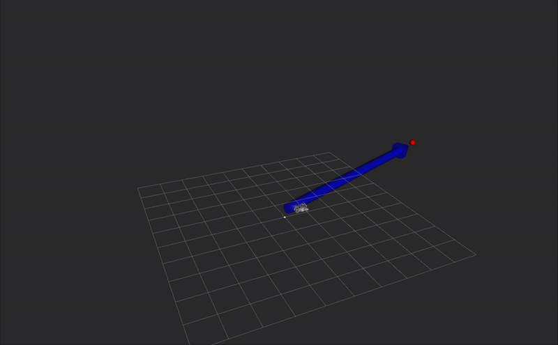
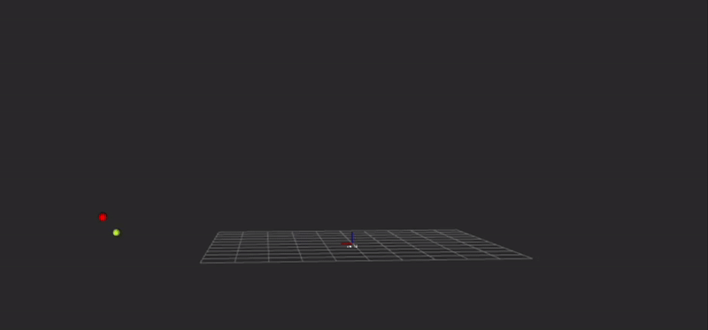

# FRobs_RL Resources

Collection of resource files for [FRobs_RL](https://github.com/jmfajardod/frobs_rl). Includes object meshes, robot descriptions, MoveIt configurations, task enviroments, training logs, trained models, and more.

## Robots resource repositories

List of all robot resources, their source repositories (if available), and what commit the resource was taken from.

| Robot or Resource  | Source                                                  | Commit                                   |
|--------------------|---------------------------------------------------------|------------------------------------------|
| ABB120              | https://github.com/ros-industrial/abb_experimental              | d41bfe3af65b25c4860ec495fd8ccc31e0585480 |
| ABB140              | https://github.com/FreddyMartinez/abb_irb140_support | 417b4f826e59b1f744bcb40b6a0ce7c4d9189dfd |
| UR5                 | https://github.com/ros-industrial/universal_robot | 06d8b9e2f5f86aa54f9f2845f11edbc84e2f951e |  
| Kobuki                | https://github.com/yujinrobot/kobuki       | 23748ed3dfb082831ca8eaaef1a0b08588dbcb65 |

## New Enviroments

List of newly added environments for UAV and mobile manipulator tasks.

| Name | Description | Observation Space | Action Space | 
| ---- |  ----------- | ----- | --------- | 
<!-- | `Robomaster_OM_ReacherEnv-v0` | An environment where a RoboMaster mobile manipulator with Open Manipulator arm needs to reach a spatial position. The robot uses a LIDAR sensor (converted to 224x224 matrix) and manipulator to navigate and reach goals in 3D space. | Dict(scan_matrix: Box(224,224), vector: Box(18,)) | Box(7,) | -->
| `Robomaster_OM_uav_RecoveryEnv-v0` | An environment where a RoboMaster mobile manipulator performs UAV recovery tasks. The robot uses its manipulator and mobile base to track and recover a UAV in a dynamic environment. | Dict(vector: Box(18,)) | Box(7,) |
| `UAV_Trajectory_predEnv-v0` | An environment for UAV trajectory prediction tasks. The UAV predicts and follows target trajectories based on current position and time-differential position information. Supports HER (Hindsight Experience Replay) for goal-conditioned learning. | Dict(current_pos: Box(3,), timediff_pos: Box(3,)) | Box(3,) |
